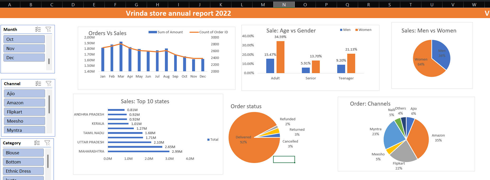

# Vrinda Store Annual Sales Analysis (2022)

## Objective
To analyze 2022 sales data and identify customer behavior, sales trends, and growth opportunities for 2023.

## Tools Used
- Microsoft Excel (Pivot Tables, VLOOKUP, Charts)

## Key Analysis Performed
- Monthly sales and order trends
- Gender and age-based customer analysis
- Top 10 states by sales
- Sales channel performance
- Product category contribution

## Outcome
The analysis helped identify high-performing months, customer segments, and sales channels to support data-driven business decisions.

## Dashboard – Annual Sales Analysis (2022)

**Key Insights:**
- Identified the best months for sales and orders.
- Highlighted top customer segments by gender and age.
- Ranked top 10 states contributing to sales.
